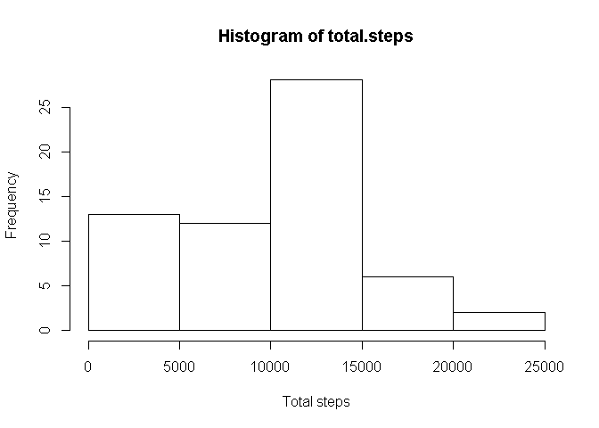
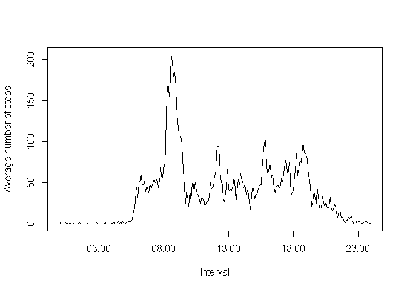
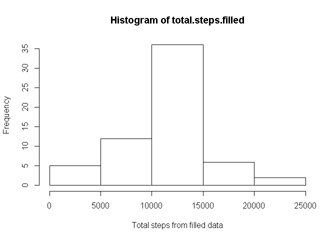
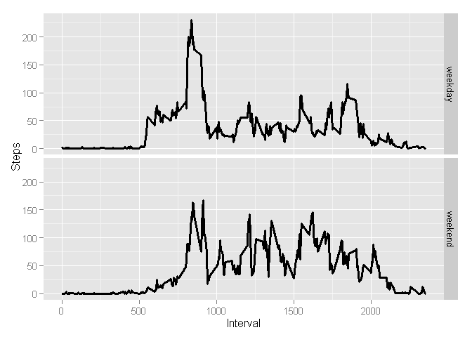

# Reproducible Research: Peer Assessment 1

### Loading and preprocessing the data.

At first, let's read the data, make it more comfortable, and take a look at it.  


```r
info <- read.csv("activity.csv")
info$interval <- formatC(info$interval, width = 4, flag = "0", format = "d")
summary(info)
```

```
##      steps                date         interval        
##  Min.   :  0.00   2012-10-01:  288   Length:17568      
##  1st Qu.:  0.00   2012-10-02:  288   Class :character  
##  Median :  0.00   2012-10-03:  288   Mode  :character  
##  Mean   : 37.38   2012-10-04:  288                     
##  3rd Qu.: 12.00   2012-10-05:  288                     
##  Max.   :806.00   2012-10-06:  288                     
##  NA's   :2304     (Other)   :15840
```

### What is mean total number of steps taken per day?

Let's count total number of steps taken per day and make a histogram of this data.  


```r
total.steps <- tapply(info$steps, info$date, sum, na.rm = TRUE)
hist(total.steps, xlab = "Total steps")
```

 

Mean of total number of steps taken per day equals to  

```r
mean(total.steps)
```

```
## [1] 9354.23
```

Median equals to 

```r
median(total.steps)
```

```
## [1] 10395
```

### What is the average daily activity pattern?

Let's make a vector of average number of steps taken, averaged across all days.  
I'll call it mean.steps.interval.


```r
number.of.interval <- as.factor(rep(seq(1, 288, 1), 61))
mean.steps.interval <- tapply(info$steps, number.of.interval, 
                              mean, na.rm = TRUE)
```

Now we can report an interval with maximum average number of steps:


```r
info$interval[match(max(mean.steps.interval), mean.steps.interval)]
```

```
## [1] "0835"
```

So this person is most active between 8:35 and 8:40.

Let's make the needed plot.


```r
plot(strptime(info$interval[1:288], "%H%M"), mean.steps.interval, type = "l", 
     xlab = "Interval", ylab = "Average number of steps")
```

 

### Imputing missing values

Let's calculate total number of NA's in the dataset.


```r
sum(is.na(info$interval))
```

```
## [1] 0
```

```r
sum(is.na(info$date))
```

```
## [1] 0
```

```r
sum(is.na(info$steps))
```

```
## [1] 2304
```

So we can consider, that there are only 2304 rows with a missing number of steps.  
I have decided to fill NA's with the mean for this interval across all days.  


```r
filled.steps <- replace(info$steps, is.na(info$steps), 
                        rep(mean.steps.interval, 61))
```

```
## Warning in replace(info$steps, is.na(info$steps),
## rep(mean.steps.interval, : число единиц для замены не является
## произведением длины замены
```

```r
filled.info <- data.frame("steps" = filled.steps, "date" = info$date, 
                          "interval" = info$interval)
summary(filled.info)
```

```
##      steps                date          interval    
##  Min.   :  0.00   2012-10-01:  288   0000   :   61  
##  1st Qu.:  0.00   2012-10-02:  288   0005   :   61  
##  Median :  0.00   2012-10-03:  288   0010   :   61  
##  Mean   : 37.38   2012-10-04:  288   0015   :   61  
##  3rd Qu.: 27.00   2012-10-05:  288   0020   :   61  
##  Max.   :806.00   2012-10-06:  288   0025   :   61  
##                   (Other)   :15840   (Other):17202
```

Let's count **new** total number of steps taken per day and make a histogram of this data.  


```r
total.steps.filled <- tapply(filled.info$steps, filled.info$date, sum)
hist(total.steps.filled, xlab = "Total steps from filled data")
```

 

Now mean of total number of steps taken per day equals to  

```r
mean(total.steps.filled)
```

```
## [1] 10766.19
```

Median equals to 

```r
median(total.steps.filled)
```

```
## [1] 10766.19
```

As we can see, both are increased.

### Are there differences in activity patterns between weekdays and weekends?

Let's create a needed factor variable.


```r
suitable.date <- filled.info$date
suitable.date <- as.character(suitable.date)
suitable.date <- as.Date(suitable.date)
day.of.week <- weekdays(suitable.date)
## Notice, that "суббота" and "воскресенье" are saturday
## and sunday in Russian.
day.of.week[day.of.week %in% c("суббота", "воскресенье")] <- "weekend"
day.of.week[!(day.of.week == "weekend")] <- "weekday"
day.of.week <- as.factor(day.of.week)
str(day.of.week)
```

```
##  Factor w/ 2 levels "weekday","weekend": 1 1 1 1 1 1 1 1 1 1 ...
```

Now let's create a needed plot.


```r
library(ggplot2)
filled.info$day.of.week <- day.of.week
mean.st.int.by.weekday <- tapply(filled.info$steps, 
                                 list(filled.info$interval,
                                      filled.info$day.of.week),
                                 mean)
mean.st.int.by.weekday <- as.vector(mean.st.int.by.weekday)
suitable.df <- data.frame(Steps = mean.st.int.by.weekday, 
                          Interval = rep(as.numeric(as.character(filled.info$interval[1:288])),
                                         2), 
                          Weekday = c(rep("weekday", 288), rep("weekend", 288)))
g <- ggplot(data = suitable.df, aes(Interval, Steps))
g1 <- g + geom_line(size = 1.2) + facet_grid(Weekday~.)
g1
```

 


The end.
